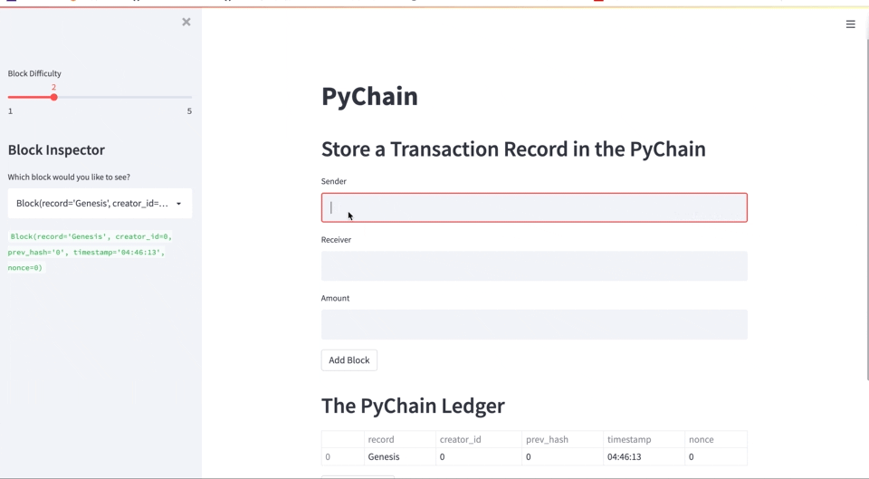

# Blockchain Webapp

## Overview:
Blockchain based web application buit with Streamlit interface and Python which allows financial transactions between banks and to verify the integrity of transactions in the ledger

## Application & process:

The application has been built using python and streamlit web interface and stores the data and methods in dataclasses i.e. Record,Block and Pychain when a new record(transaction) is added.

The steps followed for the application are as below:

1. Create a Record Data Class with attributes `sender`(datatype- "str"), `receiver`(datatype- "str") and `amount`(datatype- "float") for the transactions

2. Update Block Data Class to Store Record Data

3. Add Relevant User Inputs to the Streamlit Interface like `sender`, `receiver` and `amount`

The application further enables user to `view` and do `validation of blocks` in the ledger using hash functionality.


## Application Testing and Validation:

* Web application allows user to add transactions by entering sender, receiver and amount details in the provided spaces.
* When testing the application, the different transactions were added using different difficulty level and we can clearly see the increase in nonce with the increase in difficulty level. 
* It further enables to view a particular block using  drop down option and selecting the block.
* The application gives an option to validate the chain or the ledger.




## Technologies

This application leverages python 3.7 with the following modules

* datetime
* typing
* dataclasses
* pandas
* hashlib
* streamlit


## Installation Guide

```
conda install pandas
pip install typing
pip install streamlit
pip install dataclasses
pip install hashlib
```

## Contributor

Shivangi Gupta

## License

MIT